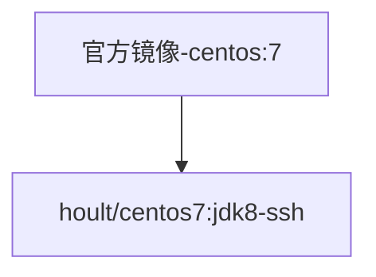

# docker-bigdata
>使用docker构建大数据开发环境，包括centos7,hadoop,hive,spark,hbase,zk,es,kafka等.

## 镜像相关介绍
### 1、镜像环境

* 系统：centos 7
* jdk8
* net-tools
* ssh服务-启动时候自启
* ssh免密服务

### 2、镜像描述

* hoult/centos7：jdk8-ssh        openssh、java8，基础镜像

### 3、镜像继承说明

其中github的分支和hub.docker 的镜像名和继承关系一致。github分支代码更新后，自动持续继承到hub镜像库。

### 4、QuickStart
1. 根据情况，是利用现成镜像还是重新打包
2. 如果是要重写构建
2.1 根据需要修改主机名和主机个数等信息（集群同步时候使用）： scripts/rsync-script（默认host: linux121-123）
2.2 在根目录下执行 `make`命令
3. 如果使用现成镜像来启动
   3.1` sh run.sh`即可
   3.2 `docker ps` 观察镜像是否正常启动