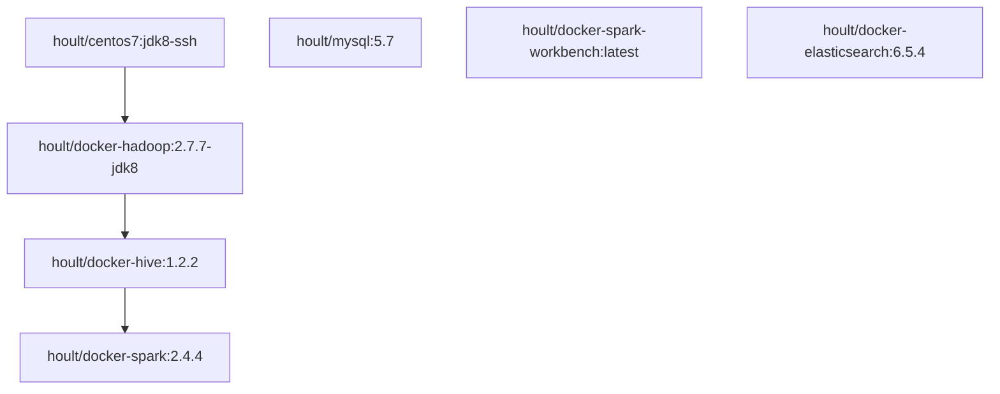

# docker-bigdata
>使用docker构建大数据开发环境，包括hadoop, hive,  spark, hbase, zk, es, kafka, 等.

## 镜像相关介绍
### 1、镜像环境

* 系统：centos 7
* Java ：java8
* Hadoop: 2.7.7
* python : 2.7.5
* hive: 1.2.2
* spark: 2.4.4
* elasticsearch: 6.5.4
* mysql: 5.7

### 2、镜像描述

* hoult/centos7：jdk8-ssh        openssh、java8，基础镜像
* hoult/docker-hadoop:2.7.7-jdk8    hadoop基础镜像
* hoult/docker-hive:1.2.2   基于hadoop基础镜像
* hoult/docker-spark:2.4.4  基于hive的镜像
* hoult/mysql:5.7  mysql5.7版本
* hoult/docker-spark-workbench spark的单机环境（仅仅为了测试环境）
* hoult/docker-elasticsearch:6.5.4

**镜像继承关系图：**

其中github的分支和hub.docker 的镜像名和继承关系一致。github分支代码更新后，自动持续继承到hub镜像库。

### 3、QuickStart
1. docker network create zoo 
2. /usr/local/hadoop/bin/hdfs namenode -format
3. /usr/local/hadoop/sbin/start-all.sh
4. hive --service metastore
5. spark-sql -Phive -Phive-thriftserver (启动spark时候的conf 里面的hive-site.xml 会覆盖hive原本的配置属性)

**注意**：hoult/docker-hadoop:2.7.7-jdk8, hoult/docker-hive:1.2.2, hoult/docker-spark:2.4.4只可以按需求启动其中的一个，hoult/mysql:5.7是hive的元数据库，如果用到hive，需要先启动此镜像容器(或者后启动，重启集群)
metastore服务默认关闭，启动任意一个镜像都需要先format和启动hadoop集群，zoo网络是整个集群的,如果有连接的问题docker network inspect zoo ，查看是否在组网中.

## 待修复问题
- [x] hive 默认文件file改为集群
- [] hive on tez 暂还不支持
- [] elasticsearch 单机模式ok,集群模式还有待修复
- [] 一键扩容hadoop容器